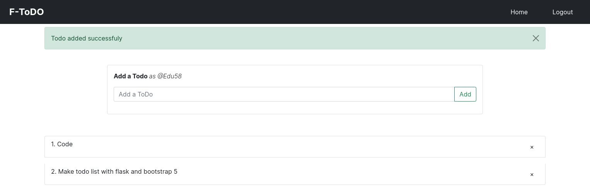

Flask ToDo List

## Technologies used
- Flask
- Flask-Bootstrap
- Flask-Login
- Flask-SQLAchemy
- Flask

## Description
This todo list app allows users to create accounts, login, add todos, delete todos and logout. It includes route guarding which means a user cannot access the home url before logging in. The app uses fetch api calls to delete a todo.

